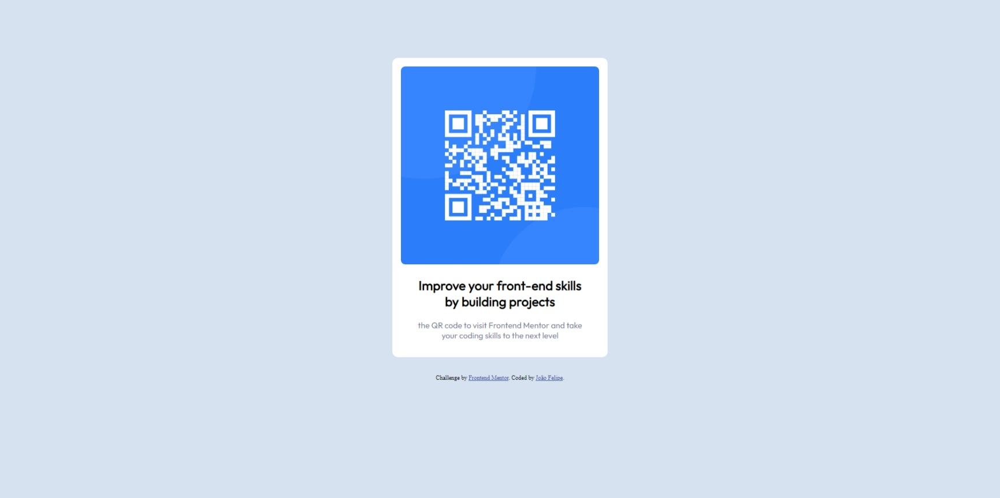

# Frontend Mentor - Solução de componente de código QR

Esta é uma solução para o [desafio do componente de código QR no Frontend Mentor](https://www.frontendmentor.io/challenges/qr-code-component-iux_sIO_H). Os desafios do Frontend Mentor ajudam você a melhorar suas habilidades de codificação criando projetos realistas.  

## Índice

- [Visão geral](#overview)
  - [Captura de tela](#screenshot)
  - [Ligações](#links)
- [Meu processo](processo #my)
  - [Construído com](#built-com)
  - [O que eu aprendi](#what-i-aprendi)
  - [Desenvolvimento contínuo](#continued-desenvolvimento)
  - [Recursos úteis](#useful-recursos)
- [Autor](#author)
- [Agradecimentos](#acknowledgments)

## Overview

### Screenshot



### Links

- Solution URL: [Add solution URL here](https://github.com/FelipeMT21/qr-code-component)

## Meu processo

### Construído com

- Marcação HTML5 semântica
- Propriedades personalizadas CSS
- Flexbox
- Grade CSS
- Fluxo de trabalho mobile-first

### O que aprendi

```html
<h1><div class="white">
    <div>
      
    </div>
    <div class="text">
      <h2>Improve your front-end skills by building projects</h2>
      <p>the QR code to visit Frontend Mentor and take your coding skills to the next level</p>
    </div>
  </div></h1>
```
```css
.proud-of-this-css {
  .white{
    background-color: white;
    border-radius: 10px;
    margin: auto;
    position: relative;
    padding: 16px;
    width: 20%;
}
}
```

### Desenvolvimento contínuo

Pretendo aprofundar mais em posições e conhecer comandos novos, para aumentar meu leque de possibilidades em resolução de problemas futuros. 

### Recursos úteis

- [ChatGPT](https://chat.openai.com/) - Isso me ajudou bastante em duvidas específicas. Eu realmente gostei deste padrão e vou usá-lo daqui para frente.
- [Developer Mozilla MDN](https://developer.mozilla.org/pt-BR/) - Este é um artigo incrível que me ajudou a explorar varias possiblidades de solucionar o meu desafio. Eu recomendaria para quem ainda está aprendendo esse conceito.

## Autor

- Website - [João Felipe - Development Software](https://felipemt21.github.io/curriculo/)
- Mentor Frontend - [@FelipeMT21](https://www.frontendmentor.io/profile/FelipeMT21)
- Linkedin - [João Felipe](https://www.linkedin.com/in/jo%C3%A3o-felipe-1028aa210/)

## Agradecimentos

Usei bastante o Developer Mozilla MDN e o ChatGPT para solução do meu desafio.